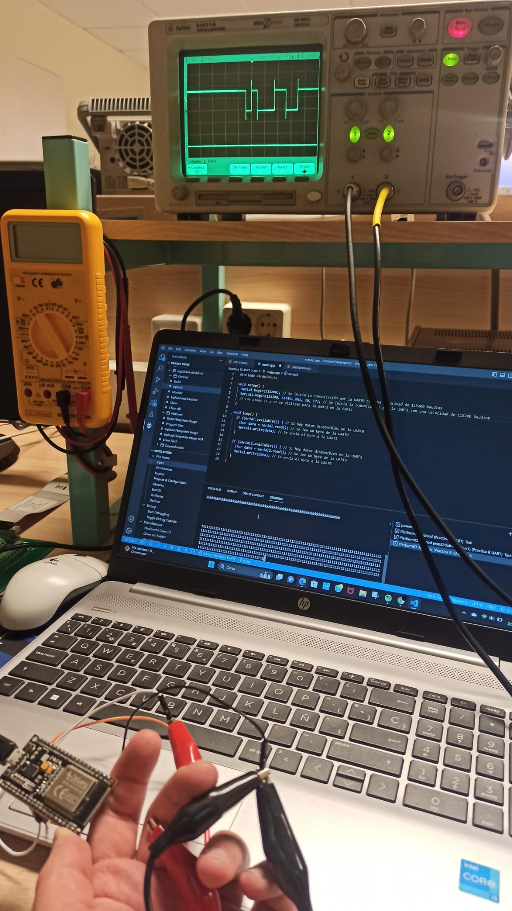

## PRACTICA 8
 En esta practica utilizaremos la comunicacion UART(Universal Syncronous Asyncronous Receiver Transmitter) que es la tencnologia que utiliza el Serial monitor.
 **CODIGO**
 ```cpp
 #include <Arduino.h>

void setup() {
  Serial.begin(115200); // Se inicia la comunicación por la UART0 con una velocidad de 115200 baudios
  Serial2.begin(115200, SERIAL_8N1, 16, 17); // Se inicia la comunicación por la UART2 con una velocidad de 115200 baudios
  // Los pines 16 y 17 se utilizan para la UART2 en la ESP32
}

void loop() {
  if (Serial.available()) { // Si hay datos disponibles en la UART0
    char data = Serial.read(); // Se lee un byte de la UART0
    Serial2.write(data); // Se envía el byte a la UART2
  }
  
  if (Serial2.available()) { // Si hay datos disponibles en la UART2
    char data = Serial2.read(); // Se lee un byte de la UART2
    Serial.write(data); // Se envía el byte a la UART0
  }
}


```
**Librerias**
En este programa no es necesario incluir ningun tipo de libreria solo con las funciones basicas podemos ver el funcionamiento de la comunicacion UART.

**SETUP**
```cpp
void setup() {
  Serial.begin(115200); // Se inicia la comunicación por la UART0 con una velocidad de 115200 baudios
  Serial2.begin(115200, SERIAL_8N1, 16, 17); // Se inicia la comunicación por la UART2 con una velocidad de 115200 baudios
  // Los pines 16 y 17 se utilizan para la UART2 en la ESP32
}
```
Iniciamos el serial y establecemos un Serial2 en los pines 16 y 17 para ver que informacion recibimos en el standar 8N1


**LOOP**
```cpp
void loop() {
  if (Serial.available()) { // Si hay datos disponibles en la UART0
    char data = Serial.read(); // Se lee un byte de la UART0
    Serial2.write(data); // Se envía el byte a la UART2
  }
  
  if (Serial2.available()) { // Si hay datos disponibles en la UART2
    char data = Serial2.read(); // Se lee un byte de la UART2
    Serial.write(data); // Se envía el byte a la UART0
  }
}
```
Von este sencillo programa podemos enviar datos y recicibir datos por los pines 16 y 17 y mostrar que es lo que llega a traves del serial monitor.
Para ver la codificacion de los datos conectmos un osciloscopio a estos pines y hacemos una instantanea de la señal.

En este caso hemos enviado un "1" por el Serial a traves de los pines y como podemos ver en la imagen vemos como se envia el caracter en codigo ascii en binario "1="00110001" envia en serie empezando por el bit de mayor tamaño un paquete de 8bits que podemos ver en el osciloscopio
